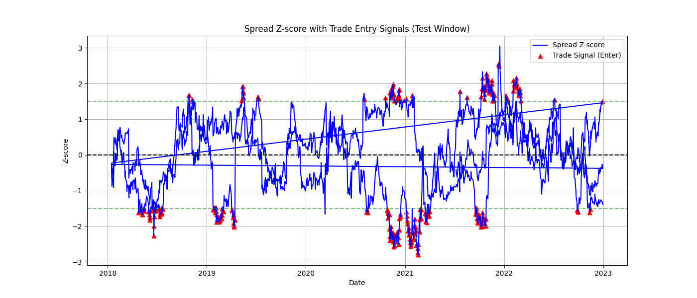

# Cointegration-Based Pairs Trading Strategy with ML

> 💼 **A machine learning-powered pairs trading strategy combining statistical cointegration with XGBoost for predictive trade execution.**

## 📈 Overview
This project builds a statistical arbitrage strategy using cointegrated stock pairs. It detects pairs of stocks whose prices move together long-term, then uses a machine learning model(XG Boost, supervised learning technique) to predict when deviations will revert profitably.

The core idea: when one stock in a highly related pair diverges significantly from the mean spread, expect the prices to revert. We short the overpriced stock and long the underpriced one, aiming to profit from mean reversion.

--------------------------------------------------------------------

## 🚀 How to Run
### Step 1
Clone the repo:
git clone <https://github.com/Taranm1/Quant_Trading_Project.git>
cd Quant_Trading_Project

### Step 2
Install dependencies:
pip install -r requirements.txt

### Step 3
Run the main script:
python3 main.py

--------------------------------------------------------------------

## 🧠 Features
- Automated cointegration detection via Engle-Granger test
- Spread feature engineering: z-scores(now and future), momentum, Bollinger Bands(including width), rolling spread mean, rolling spread std, rolling zscore, zscore velocity and acceleration
- XGBoost classification model with SMOTE for imbalanced data(oversample positive trades to allow model to learn more)
- Backtesting with PnL calculation and trade signal visualization

## 🛠 Requirements
Key libraries used:
- pandas, numpy, yfinance for data collection and handling
- statsmodels for cointegration tests
- scikit-learn, xgboost, imbalanced-learn for ML modeling
- matplotlib for plotting

## 📊 Outputs
- Classification performance reports
- Visualizations of spread and trading signals
- Backtest stats: total PnL, number of trades, win rate (on the last testing set on real live unseen data this model achieved a trade win rate of 69.5% and capturing a total of 55.484 in z score movement)

Below is an example of a backtest trade with z-score thresholds and entry signals, profit is made by entering a trade and reverting back towards the mean spread then exiting the trade:

--------------------------------------------------------------------

## 📚 Reflection & Learning
### Overall Approach
I first identify cointegrated stock pairs using the Engle-Granger method, which tests if the spread between two stock prices is stationary — a sign they move together long-term. For each pair, I estimate a hedge ratio with linear regression to build the spread.

When the spread deviates strongly from its mean, I expect it to revert. By taking opposing positions (short overpriced stock, long underpriced stock), the strategy aims to profit from this mean reversion.

### Data Collection
I use Yahoo Finance API to download historical prices for a basket of stocks, handle missing data with forward and backward filling, and take natural logarithms of prices. Log prices help stabilize variance and improve linear modeling.

#### Cointegration Testing
Pairs are tested using the Engle-Granger cointegration test. Pairs with low p-values (under 0.1) are considered strongly cointegrated and selected for further modeling.

### Feature Engineering & ML
From each pair’s spread, I engineer features like z-score, rolling volatility, momentum, and Bollinger Bands. Labels for profitable trades are generated based on spread movements after signals.

An XGBoost classifier trained on these features predicts profitable trade opportunities. SMOTE is applied to handle class imbalance, improving model robustness.

--------------------------------------------------------------------

## Key Learnings
- How to implement and interpret stationarity and cointegration tests
- Importance of feature engineering in time-series financial data
- Handling imbalanced datasets with SMOTE for better classification
- Evaluating model performance via expanding-window backtesting

## Challenges
- Managing noisy and non-stationary financial data
- Risk of overfitting given limited positive trade signals
- Data leakage(originally tested using features from one large combined dataset with all stocks, this leads to inaccuracy not all stock pairs behave the same, I now split the data for pairs of stocks and tested on those)
- Labelling with only z scores and many false signals leading to losses(I changed this to label positive trades based on profit)

## Future Improvements
- Implement rolling-window cointegration to adapt to changing relationships
- Explore reinforcement learning or other approaches for trade timing
- Increase dataset scope and incorporate transaction costs for realism

--------------------------------------------------------------------

## 🧰 Tech Stack
- **Languages**: Python
- **Libraries**: Pandas, NumPy, Statsmodels, Scikit-learn, XGBoost, Imbalanced-learn, Matplotlib
- **Concepts**: Cointegration, Stationarity, Supervised Learning, Feature Engineering, Backtesting, SMOTE, Time Series Analysis

--------------------------------------------------------------------

# Contact details
E-mail: MalhiTaran182005@gmail.com